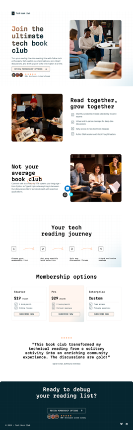

# Frontend Mentor - Tech book club landing page solution

This is a solution to the [Tech book club landing page challenge on Frontend Mentor](https://www.frontendmentor.io/challenges/tech-book-club-landing-page-fZQidjHU73). 

## Overview

### The challenge

Users should be able to:

- View the optimal layout for the interface depending on their device's screen size
- See hover and focus states for all interactive elements on the page

### Screenshot

### Links

- Solution URL: [https://github.com/toshirokubota/tech-book-club-landing-page](https://github.com/toshirokubota/tech-book-club-landing-page)
- Live Site URL: [https://toshirokubota.github.io/tech-book-club-landing-page/](https://toshirokubota.github.io/tech-book-club-landing-page/)

## My process

### Built with

- Semantic HTML5 markup
- CSS custom properties
- Flexbox
- CSS Grid
- Mobile-first workflow

### What I learned

In this project, I used picture tag to provide images of different sizes/resolutions appropriate for different screen sizes. Previously, I did it through javascript and I felt it was not the best practice.

I was able to add color gradient to some text. 

### Continued development

I feel that I have gotten more comfortable with flexbox. Sometimes, I felt in this project that I might be over-using the layout type. I am still often confused with justify-* and align-* properties, so I need to keep working on it.

I did not get to use grid much in this project. So I want to keep workiong on it as well.

I have been problem setting padding and margin. Often I found tweeking them just to makde the layout looks "correct" but end up having a highly complicated style sheet. I want to start focusing on simpler design with DRY.

### Useful resources

## Author

- Frontend Mentor - [@yourusername](https://www.frontendmentor.io/profile/toshirokubota)

## Acknowledgments

